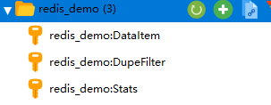

# Queue
爬虫队列，默认实现的有：内存、redis、rabbitmq三种队列，另外如果有需求可以自定义队列

内存和rabbitmq除了存储，其他的基本差不多。rabbitmq队列还不完善

redis实现比较多的功能。

## 使用
默认使用的是内存队列，切换成redis队列设置queue_cls和redis_setting，当使用redis作为队列的时候，
信息统计和去重默认redis

```python
queue_cls = const.RedisQueue
# setting可以是uri，也可以是配置字典
# redis_setting = "redis://127.0.0.1:6379/0?encoding=utf-8"
redis_setting = {
    'host': '127.0.0.1',
    'port': 6379,
    'db': 0,
    'password': ''
}
```
例子：
```python
import hoopa
from hoopa.settings import const


class DataItem(hoopa.Item):
    title: str
    type: str


class RedisDemoSpider(hoopa.Spider):
    name = "redis_demo"
    start_urls = ["http://httpbin.org/json"]

    # 设置队列为redis
    queue_cls = const.RedisQueue
    redis_setting = "redis://127.0.0.1:6379/0?encoding=utf-8"

    async def parse(self, request, response):
        data = response.json()
        slides = data["slideshow"]["slides"]
        for slide in slides:
            data_item = DataItem()
            data_item.title = slide["title"]
            data_item.type = slide["type"]
            yield data_item


if __name__ == "__main__":
    RedisDemoSpider.start()

```
运行完成后，redis截图：

- DupeFilter: 去重指纹
  
- DataItem: 数据
  
- Stats: 统计

